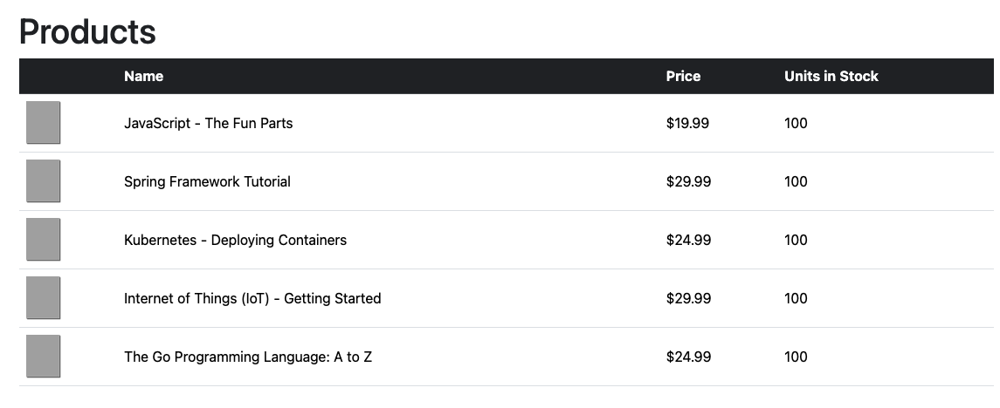
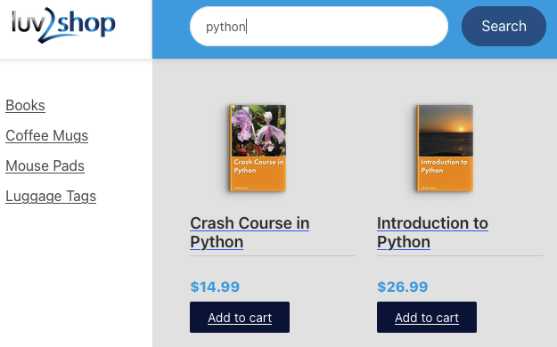
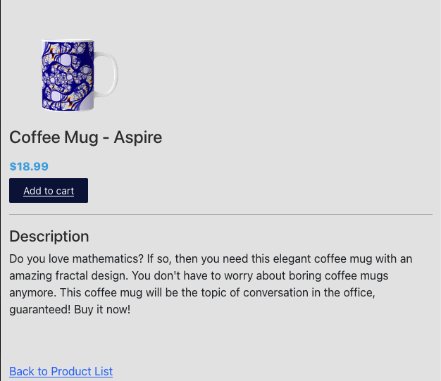
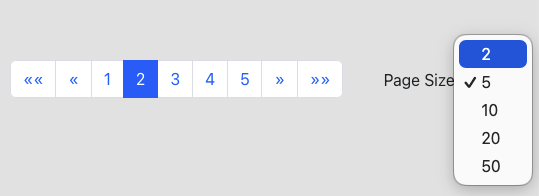
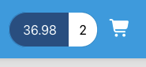
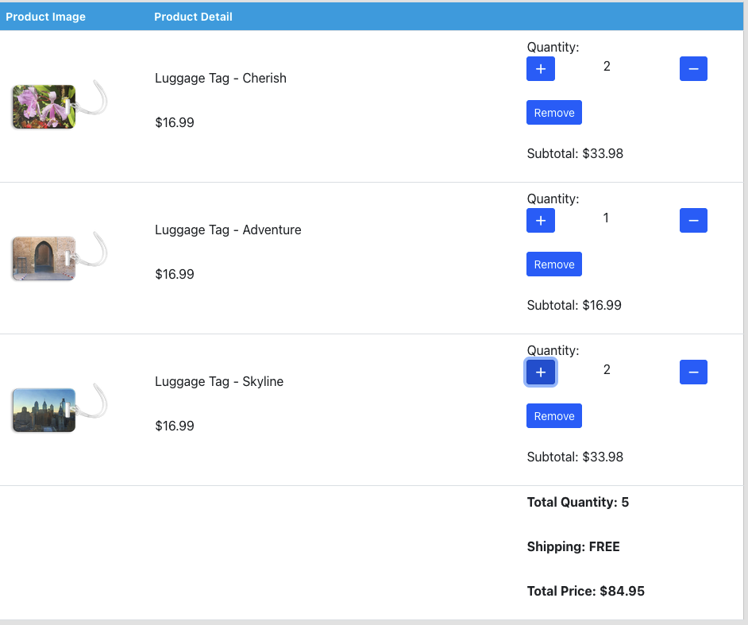
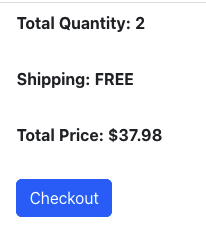
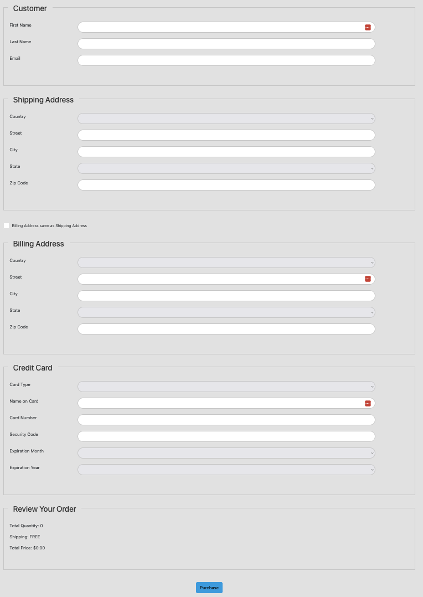

## Full Stack: Angular & Java Spring Boot E-Commerce Website
**Current Status: Basic Front End**

### Changes Implemented:
**Starter Files**
- Includes database setup scripts
  - `01-create-user.sql` creates MySQL user for application
  - `02-create-products.sql` creates `product` & `product_Category` table & load tables with sample data

**Backend: Spring Boot**
- `Product` class
  - Includes all fields that will be mapped into database table `product`
  - Added appropiate annotations to each field to map into corresponding column
  - Added many to one relationship

- `ProductCategory` class
  - Includes 2 fields that will be mapped into database table `product_category`
  - Added appropiate annotations to each field to map into corresponding column
  - Added one to many relationship

- `ProductRepository` & `ProductCategoryRepository` interfaces
  - Defines repository interfaces for automatic REST endpoint generation
  - By default => Spring Data REST will create endpoints based on entity provided

- `MyDataRestConfig` class
  - Configuration class to disable HTTP methods POST, PUT, DELETE for `Product` & `ProductCategory`

**Frontend: Angular**
- `product.ts`: Product TypeScript Class
  - Includes product properties matching REST API response
  - Used constructor parameter properties to automatically declare and assign fields

- `product.service.ts`: Product Service to call REST APIs
  - TypeScript helper class running on client responsible for calling backend APIs
  - Makes request to backend url -> grabs data & unwraps -> makes it available as an array of products

- `product-list.component.ts`: Product List TypeScript Class
  - Developed Angular to Subscribe to Data
  - Added asynchronous call so subscribing triggers the observable & makes the API call
  - Data returned is assigned to own property `products`

- `product-list.component.html`: HTML Page for Product List
  - Used Angular `ngFor` directive to iterate over products to display product name & price
  - Added Angular currency pipe to format price in USD
  - Added CrossOrigin Support to Spring Boot

### Version 2.0 Changes
- `app.component.html`: HTML Home Page for App
  - Template updated to include side bar, header, footer and product list component

- `product-list-grid.component.html`: HTML Page for Product List
  - Updated product list component to be shown as a grid 

**Search for Products by Category**
- `app.modules.ts`
  - Defined 5 routes: "category/:id", "category", "prooducts","","**"
    - Includes empty and any route that doesn't match
  - Configured router based on routes
- `app.component.html`
  - Set up router links to pass category id param
  - Once user clicks link -> apply custom CSS style 
- `product-list.component.ts`  Product List TypeScript Class
  - Enhance component to read category id parameter
  - Now can retrieve products for given category id
- `product.service.ts` Angular Product Service
  - Updated `getProductList()` to accept parameter for number
  - Updated url to call new url based on category id
- Modify Spring Boot App
  - REST repository needs new method 
  - Modify to only return products for given category id

**Search for Products by Category with Dynamic Search Component**
- Modify Spring Boot `MyDataRestConfig.java` to expose entity ids
- Created new component for menu `product-category-menu`
- Updated `product-category-menu.component.ts` to read categories from service
- Updated `product.service.ts` to call URL on Spring Boot app 
- Replace hard-coded links with menu component
  - menu component loops over categories & builds links dynamically

**Search for Products by Keyword**
- Modify Spring Boot `ProductRepository.java` to add new search method
  - Method searches products containing the keyword/name provided by user
- Created new component `search`
  - Updated component to send data to search route
- Added new angular route for searching in `app.module.ts`
- Updated `product-list` component to search for products with product service
- Updated `product.service.ts` to call REST API with url based on keyword
- Example: Searching for product with keyword 'python'
  

**Product Master Detail View**
- Created new component for product details: `ProductDetailsComponent`
- Added new Angular route for product details in `app.module.ts`
- Added router links to product-list-grid HTML to product image & product name
- Updated `ProductDetailsComponent.ts` to retrieve product fronm ProductService
- Updated `product.service.ts` to call URL for retrieving a product
- Updated `ProductDetailsComponent` HTML page to display product details
- Example: Product Detail View
  

**Pagination Support**
- Installed `ng-bootstrap` & imported module for it in `app.module.ts`
- Refactor interface for `GetResponseProducts` from `ProductService` to support pagination meta data
- Added Pagination API calls to `ProductService`
- Updated `ProductListComponent` to handle pagination 
- Updated `ProductListComponent` HTML template to use ng-bootstrap pagination component
  - Added a drop down list for page size selection
  - Added boundary links to select first or last page
- Added pagination support for keyword search
- Pagination Component
  

**Shopping Cart Component**
- Created new component `CartStatus`
  - Added HTML template 
  - Added click handler for "Add to cart" button in `ProductListComponent` HTML page
  - Updated `ProductListComponent.ts` with click handler method
  - Component: 
  
- Added functionality to add products to cart
  - Created model class: `CartItem` that contains essential fields of `Product` for use in cart
  - Created `CartService` to handle all logic
  - Modify `ProductListComponent` to call `CartService` 
  - Updated `CartStatusComponent` to subscribe to `CartService`
  - Updated `CartStatusComponent` HTML to display cart total price & quantity
- Added functionality to add products to cart from details view
  - Added click handler for "Add to cart" button on `product-details.component.html`
  - Updated `ProductDetailsComponent` with click handler method

**Shopping Cart - List Items**
- Created new component `CartDetailsComponent`
- Added new route for `CartDetailsComponent` in `app.module.ts`
- Updated link for shopping cart icon in `cart-status` component HTML template
- Added logic for retriving cart items in `cart-details.component.ts`
- Added HTML template for `CartDetailsComponent`
  - When no items are in cart, message is displayed
- Added increment & decrement buttons to update quantity for a product
  - Added on click event handler & updated `CartDetailsComponent` with click handler method
- Added remove button to remove complete quantity of a product
- Example: Shopping cart displaying items
  

**Checkout Form**
- Created new component `Checkout`
- Added new route for `Checkout` component
- Added checkout button & link to `Checkout` component to `Cart-details` component
- Button: 
  
- Added support for reactive forms
- Defined form in `Checkout` component `.ts` file
  - Includes groups forms for customer, shipping address, billing address, credit card
- Added forms to `Checkout` HTML component using form controls
- Added event handler for form submission 
  - Console logs message for now
- Checkout Page with forms:
  